[](https://git-scm.com)

# Installation and Configuration
Need to distibuted your project in control system space? First you must to download this software on [Git Downloads](https://git-scm.com/downloads)

This page consists of:
* How to install Git server on [Windows](#windows)
* How to install Git server on [Linux/Unix](#linux)
* [Initial](#initial-configuration) configuration after installation

Please, make sure that you have [downloaded](#download-source) Git according to the OS on your PC before running.

## Windows
This important to know your architecture computer. You have to download 32 bit version or 64 bit version, depending on your PC.

Open the Git file installer, and you can follow the guide on that executable file. Make sure to choose what you need and adjust it according on your specification PC.

[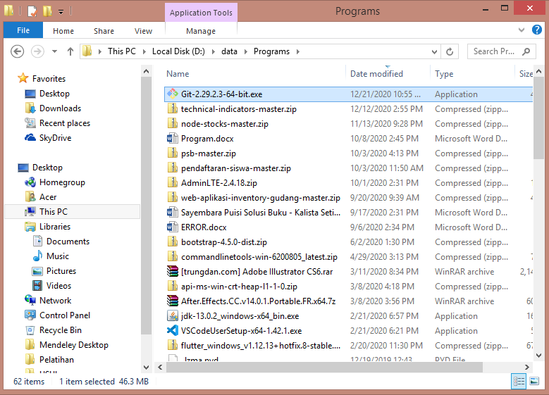](get-file-installer)

Click button `run` on this message-box to run that executable file.

[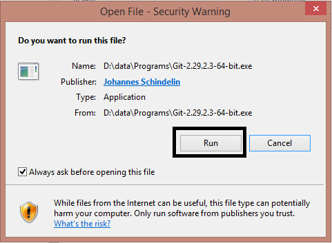](click-run)

After reading this GNU General Public Git license information, click the `next` button.

[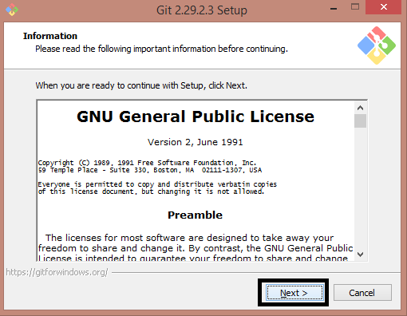](git-license)

Select destination location, then click the `next` button.

[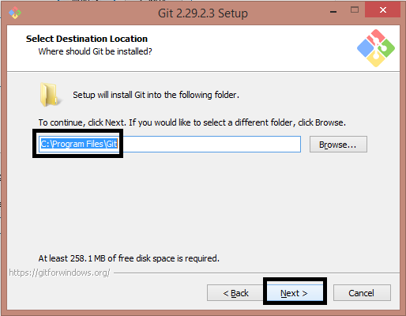](git-location)

Select components as shown below, then click the `next` button.

[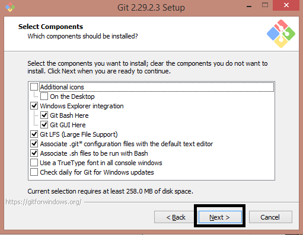](git-components)

Choose default editor as shown below if you have installed VS Code or customize the one that you have, then click the `next` button.

[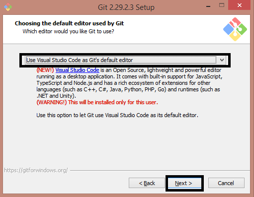](git-editor)

Adjusting the name of the initial branch as shown below, then click the `next` button.

[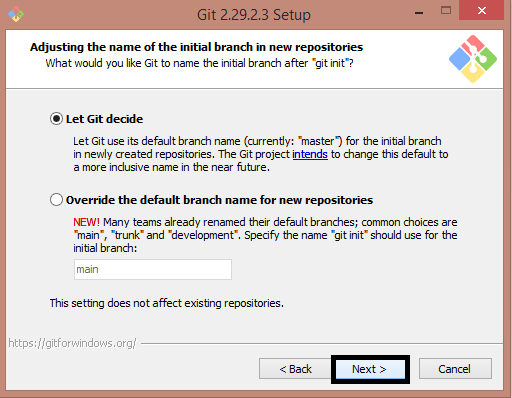](git-branch)

Adjusting the path environment as shown below, then click the `next` button.

[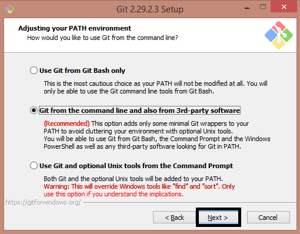](git-path-environment)

Choose HTTPS transport backend as shown below, then click the `next` button.

[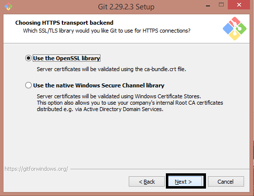](git-lib-conn)

Configure the line ending conversions as shown below, then click the `next` button.

[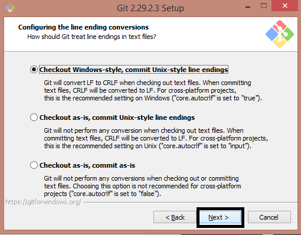](git-line)

Configure the terminal emulator as shown below, then click the `next` button.

[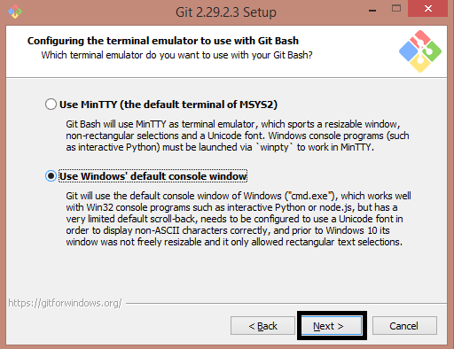](git-terminal)

Choose default as shown below, then click the `next` button.

[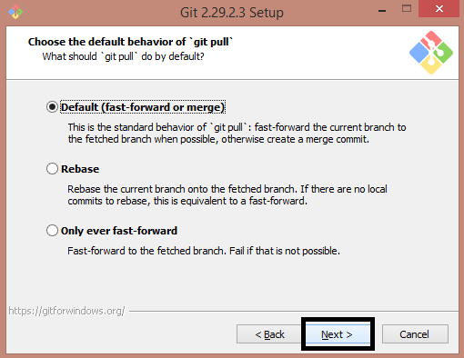](git-pull)

Choose a credential helper as shown below, then click the `next` button.

[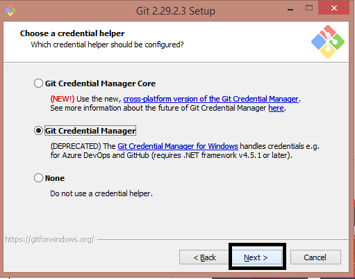](git-credential)

Configure extra option as shown below, then click the `next` button.

[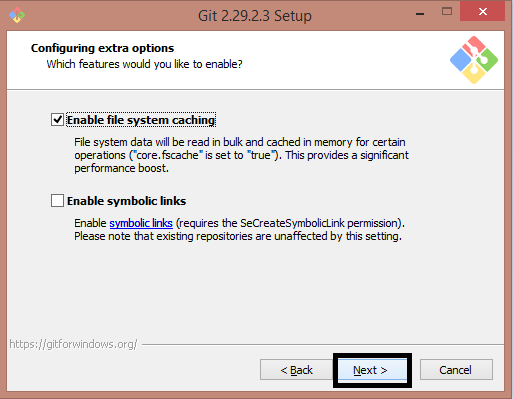](git-ext-opt)

Ignore the following options, then click the `next` button.

[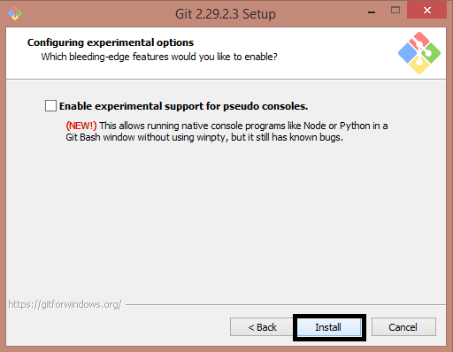](git-opt)

Wait until the process is complete.

[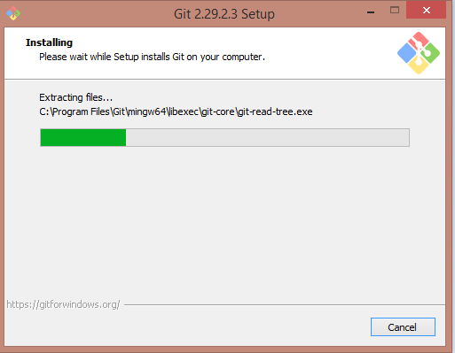](git-load)

Finally, you've installed Git.

[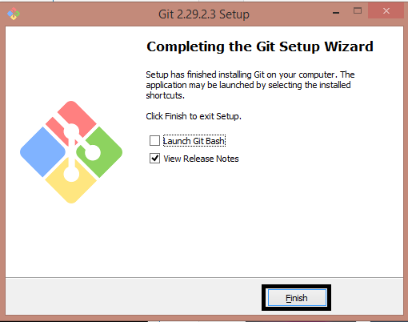](git-complete)

Open the command prompt, and use the command as shown below to know the Git version:

```
git --version
```

[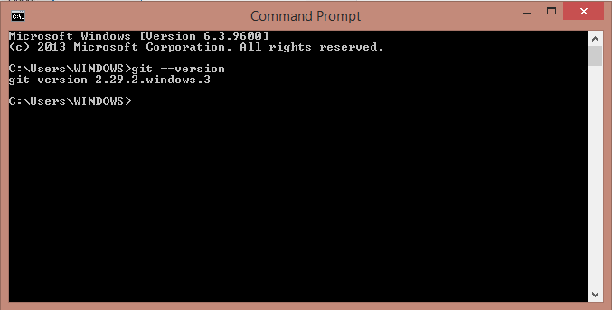](git-version)


## Linux
Installing Git on the Debian family of distributions can use the command:
```diff
- sudo apt install git
```
or
```
sudo apt-get install git
```
on Fedora
```
yum install git
```
After that, you can check the version of git installed with:
```
git --version
```

## Initial Configuration

Before use the Git, configure *name* and *email* in your terminal or command prompt. Example:
```
git config --global user.name "Kalista Setiawan"
git config --global user.email setiawankalista501@gmail.com
```

[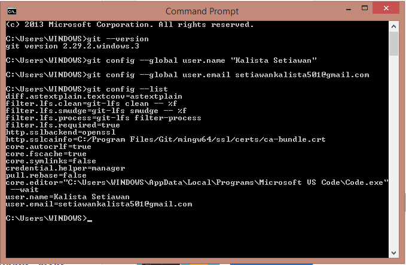](git-configure)

Let's make your first repository in Git. First, open `Git Bash` as shown below

[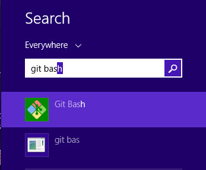](git-bash)

Use the command:
```
git init latihan-1
```
[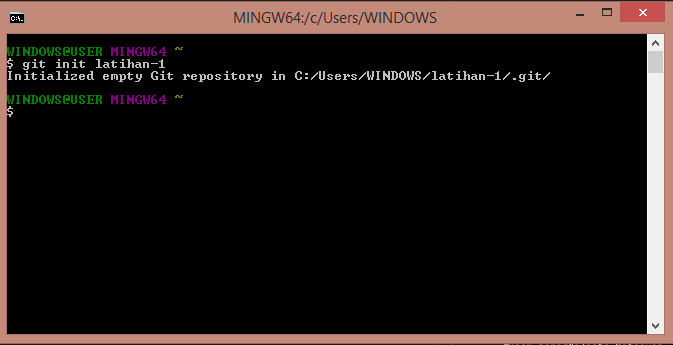](git-lat1)

Set new file(s) or folder(s) in your local repository and let's try to add these files into Git Repository use the command:
```
git add <file>
```
[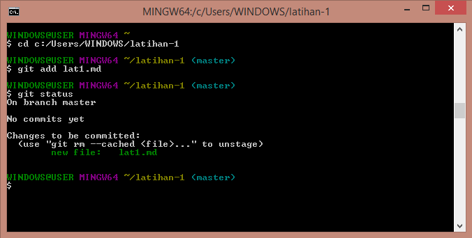](git-add-file)

Or on Windows you can go to your folder, click the `right` on mouse, and select `git bash`.

[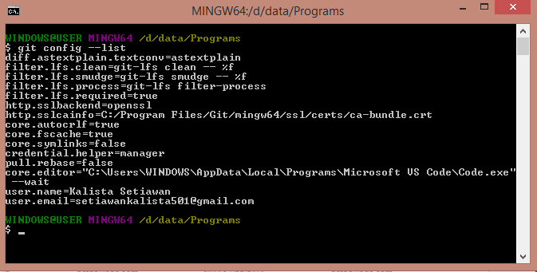](git-bash)

Use the command as shown below to initialize your local repository according to the folder you open:
```
git init .
```

To add all your file(s) or folder(s) use the command:
```
git add .
```

## Basic Commands

* `$ git init` // Initialize local Git Repository
* `$ git add <file>` // Add file(s) to Index
* `$ git status` // Check status of working tree
* `$ git commit` // Commit changes in index
* `$ git push` // Push to remote Repository
* `$ git pull` // Pull latest from remote repository
* `$ git clone` // Copy or clone repository into a new directory
  
## Download Source
You can go easily to get the file by click this list.
* Download for [Windows](https://git-scm.com/download/win)
* Download for [Linux/Unix](https://git-scm.com/download/linux)

## References
* How To Install Git Windows - `Vladimir Kaplarevic` at [phoenixnap.com](https://phoenixnap.com/kb/how-to-install-git-windows)
* Cara Install Git dan Konfigurasi Awal yang Harus Dilakukan - `Ahmad Muhardian` at [petanikode.com](https://www.petanikode.com/git-install/)

## Summarized By

Author: Kalista Setiawan | Date: 21/12/2020

If you have any suggestions and critics - please contact me. <setiawankalista501@gmail.com>
